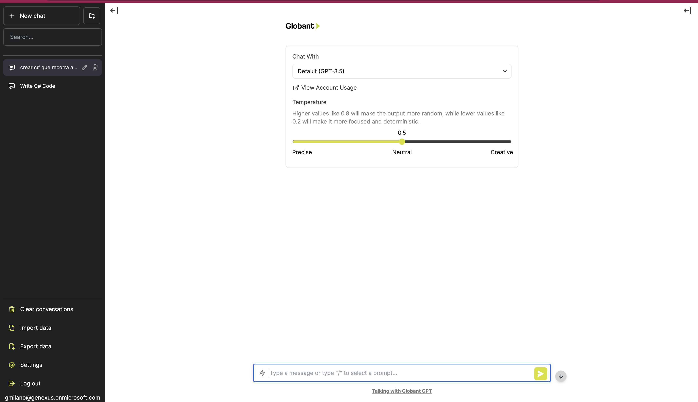

# Globant GPT UI

Globant GPT UI is a fork of Chatbot UI. It is a way to connecto to different LLMs by using [SAIA](https://docs.saia.ai/).

You can see a demo [here]()



## Deploy

In order to run locally, create a file .env.local and set all the environment variables 

**Docker**

Build locally:

```shell
docker build -t globant-gpt .
docker run -e OPENAI_API_KEY=xxxxxxxx -p 3000:3000 globant-gpt
```

Pull from ghcr:

```
docker run -e OPENAI_API_KEY=xxxxxxxx -p 3000:3000 globant-gpt
```

# Settings for your Company

## Running Locally

**1. Clone Repo**

```bash
git clone https://github.com/genexuslabs/globantGPT
```

**2. Install Dependencies**

```bash
npm i
```

**3. Provide SAIA API Key**

Create a .env.local file in the root of the repo with your OpenAI API Key or SAIA Access Token:

```bash
OPENAI_API_KEY=YOUR_KEY
```

> You can set `OPENAI_API_HOST` where access to the official OpenAI host is restricted or unavailable, allowing users to configure an alternative host for their specific needs.

> Additionally, if you have multiple OpenAI Organizations, you can set `OPENAI_ORGANIZATION` to specify one.

**4. Run App**

```bash
npm run dev
```

**5. Use It**

You should be able to start chatting.

## Configuration

When deploying the application, the following environment variables can be set:

| Environment Variable              | Default value                             | Description                                                                   |
| --------------------------------- | ----------------------------------------- | ----------------------------------------------------------------------------- |
| OPENAI_API_KEY                    |                                           | The default API key used for authentication with OpenAI                       |
| OPENAI_API_HOST                   | `https://api.beta.saia.ai/proxy/openai` | The base url, for SAIA                                                        |
|                                   |                                           |                                                                               |
| DEFAULT_PROVIDER                  | openai                                    | The default provider to be used                                               |
| DEFAULT_MODEL                     | `gpt-3.5-turbo-16k`                     | The default model to use on new conversations, for Azure use `gpt-35-turbo` |
| NEXT_PUBLIC_DEFAULT_SYSTEM_PROMPT | [see here](utils/app/const.ts)               | The default system prompt to use on new conversations                         |
| NEXT_PUBLIC_DEFAULT_TEMPERATURE   | 1                                         | The default temperature to use on new conversations                           |
| GOOGLE_API_KEY                    |                                           | See[Custom Search JSON API documentation][GCSE]                               |
| GOOGLE_CSE_ID                     |                                           | See[Custom Search JSON API documentation][GCSE]                               |


## Contact

If you have any questions, feel free to reach out to [gmilano](gmilano@genexus.com).

[GCSE]: https://developers.google.com/custom-search/v1/overview
